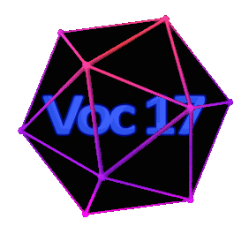

# Interstonar

> Timeline: ? semaines

> Nombre de personnes sur le projet: ?

 

📂---[Bootstrap](https://github.com/Studio-17/Epitech-Subjects/tree/main/Semester-4/B-CNA-400/Interstonar/Bootstrap)

ㅤㅤ|\_\_\_[G-CNA-400_interstonar-bootstrap.pdf](https://github.com/Studio-17/Epitech-Subjects/blob/main/Semester-4/B-CNA-400/Interstonar/Bootstrap/G-CNA-400_interstonar-bootstrap.pdf)

|\_\_\_[Interstonar](https://github.com/Studio-17/Epitech-Subjects/tree/main/Semester-4/B-CNA-400/Interstonar/Interstonar)

ㅤㅤ|\_\_\_[G-CNA-400_interstonar.pdf](https://github.com/Studio-17/Epitech-Subjects/blob/main/Semester-4/B-CNA-400/Interstonar/Interstonar/G-CNA-400_interstonar.pdf)

 

 Tests de la moulinette 

<table align="center">
    <thead>
        <tr>
            <td colspan="3" align="center"><strong>MOULINETTE</strong></td>
        </tr>
        <tr>
            <th>SOMMAIRE</th>
            <th>NB DE TESTS</th>
            <th>DETAILS</th>
        </tr>
    </thead>
    <tbody>
        <tr>
            <td rowspan="9">00 - rigor</td>
            <td rowspan="9" style="text-align: center;">9</td>
            <td>01 - No arguments</td>
        </tr>
    		<tr>
			<td>02 - Not enough arguments</td>
		</tr>
		<tr>
			<td>03 - Too many arguments</td>
		</tr>
		<tr>
			<td>04 - Incorrect arguments 1</td>
		</tr>
		<tr>
			<td>05 - Incorrect arguments 2</td>
		</tr>
		<tr>
			<td>06 - Incorrect arguments 3</td>
		</tr>
		<tr>
			<td>07 - Wrong file permissions</td>
		</tr>
		<tr>
			<td>08 - Invalid file</td>
		</tr>
		<tr>
			<td>09 - Instant collision</td>
		</tr>
        <tr>
            <td rowspan="6">10 - Global mode basic</td>
            <td rowspan="6" style="text-align: center;">6</td>
            <td>11 - One body problem - Collision</td>
        </tr>
    		<tr>
			<td>12 - Two body problem - Collision</td>
		</tr>
		<tr>
			<td>13 - Three body problem - Collision</td>
		</tr>
		<tr>
			<td>14 - One body problem - No Collision</td>
		</tr>
		<tr>
			<td>15 - Two body problem - No Collision</td>
		</tr>
		<tr>
			<td>16 - Three body problem - No Collision</td>
		</tr>
        <tr>
            <td rowspan="5">20 - Local mode</td>
            <td rowspan="5" style="text-align: center;">5</td>
            <td>21 - Basic sphere collision</td>
        </tr>
    		<tr>
			<td>22 - Basic infinite cylinder collision</td>
		</tr>
		<tr>
			<td>23 - Basic finite cylinder collision</td>
		</tr>
		<tr>
			<td>24 - Basic torus collision</td>
		</tr>
		<tr>
			<td>25 - Basic box collision</td>
		</tr>
        <tr>
            <td rowspan="2">30 - Optimization</td>
            <td rowspan="2" style="text-align: center;">2</td>
            <td>31 - Optimization global</td>
        </tr>
    		<tr>
			<td>32 - Optimization local</td>
		</tr>
        <tr>
            <td rowspan="2">40 - Global mode advanced</td>
            <td rowspan="2" style="text-align: center;">2</td>
            <td>41 - Solar system - Collision</td>
        </tr>
    		<tr>
			<td>42 - Solar system - No collision</td>
		</tr>
        <tr>
            <td rowspan="3">50 - Local mode advanced</td>
            <td rowspan="3" style="text-align: center;">3</td>
            <td>51 - Following cylinder</td>
        </tr>
    		<tr>
			<td>52 - Scene no collision</td>
		</tr>
		<tr>
			<td>53 - Scene collision</td>
		</tr>
	</tbody>
</table>

 

[↩️ Revenir au module](https://github.com/Studio-17/Epitech-Subjects/tree/main/Semester-4/B-CNA-400)

[↩️ Revenir au Semester-4](https://github.com/Studio-17/Epitech-Subjects/tree/main/Semester-4)

[↩️ Revenir à l'accueil](https://github.com/Studio-17/Epitech-Subjects)

 

---

